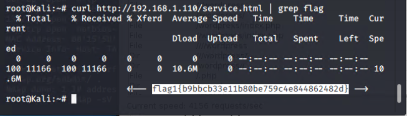
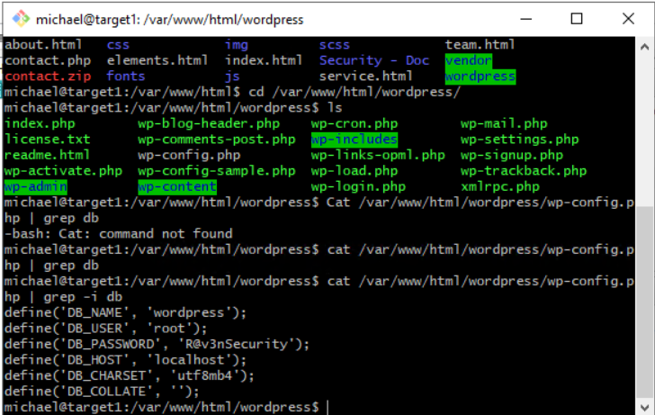

# Blue Team: Summary of Operations

## Table of Contents

-   Network Topology
-   Description of Targets
-   Monitoring the Targets
-   Patterns of Traffic & Behavior

### Network Topology

### Description of Target

The target of this attack was: `Target 1` 192.168.1.110.

Target 1 is an Apache web server and has SSH enabled, so ports 80 and 22
are possible ports of entry for attackers.

As such, the following alerts have been implemented:

Excessive HTTP Errors

HTTP Request Size Monitor

CPU Usage Monitor

### Monitoring the Targets

Traffic to these services should be carefully monitored. To this end, we
have implemented the alerts below:

#### Alert 1: Excessive HTTP Errors

Alert 1 is implemented as follows:

\- **Metric**: http.response.status_code

\- **Threshold**: 400

\- **Vulnerability Mitigated**: Brute Force Attack

\- **Reliability**: This has a high reliability due to the monitoring of
400+ error codes. If an excessive amount of these errors occur in a 5
minute period, it is most likely a brute force or enumeration attack.

#### Alert 2: HTTP Request Size Monitor

Alert 2 is implemented as follows:

\- **Metric**: http.request.bytes

\- **Threshold**: 3500 bytes

**- Vulnerability Mitigated**: Code injection in HTTP requests (XSS and
CRLF) or DDOS

\- **Reliability**: This alert by itself can cause a lot of false
positives if there is a large amount of legitimate traffic. When used in
combination with other alerts it becomes more reliable in detecting DDOS
attacks

#### Alert 3: CPU Usage Monitor

Alert 3 is implemented as follows:

\- **Metric**: system.process.cpu.total.pct

\- **Threshold**: .5

\- **Vulnerability Mitigated**: Virus/Malware or DDOS

\- **Reliability**: This alert is can be reliable if loads stay
consistent for a long period of time, and the have a spike. When used in
conjunction with the HTTP Request Size Monitor can detect a DDOS attack.
