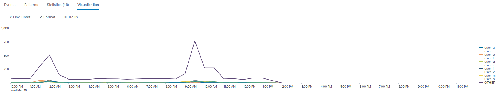

## Unit 19 Homework: Protecting VSI from Future Attacks

### Scenario

In the previous class, you set up your SOC and monitored attacks from
JobeCorp. Now, you will need to design mitigation strategies to protect
VSI from future attacks.

You are tasked with using your findings from the Master of SOC activity
to answer questions about mitigation strategies.

### System Requirements

You will be using the Splunk app located in the Ubuntu VM.

### Logs

Use the same log files you used during the Master of SOC activity:

-   [Windows Logs](resources/windows_server_logs.csv)
-   [Windows Attack Logs](resources/windows_server_attack_logs.csv)
-   [Apache Webserver Logs](resources/apache_logs.txt)
-   [Apache Webserver Attack Logs](resources/apache_attack_logs.txt)

### Part 1: Windows Server Attack

Note: This is a public-facing windows server that VSI employees access.

#### Question 1

-   Several users were impacted during the attack on March 25th.
-   Based on the attack signatures, what mitigations would you recommend
    to protect each user account?
    -   Strategic Solution:

> Implementing a password less strategy for logins. This would be done
> by implementing a FIDO solution using biometrics or a yubi key style
> device for logins.
>
>  style="width:6.48542in;height:1.81597in" />

-   User Account Solution:

> User_K:
>
> Setup alerts to monitor for user password changes.
>
> User_A:
>
> Create a more complex password that cannot be brute forced attacked .
>
> User_J:
>
> Reset
> the users password immediately, due the user account being breached.

#### Question 2

-   VSI has insider information that JobeCorp attempted to target users
    by sending “Bad Logins” to lock out every user.
-   What sort of mitigation could you use to protect against this?

> Set a group policy that unlocks after 30 minutes of no attempts

### Part 2: Apache Webserver Attack:

#### Question 1

-   Based on the geographic map, recommend a firewall rule that the
    networking team should implement.
-   Provide a “plain english” description of the rule.
    -   For example: “Block all incoming HTTP traffic where the source
        IP comes from the city of Los Angeles.”
-   Provide a screen shot of the geographic map that justifies why you
    created this rule.
    -   Base on the information from the attack log, all incoming
        traffic should be blocked from the Ukraine

>  alt="Table Description automatically generated" />

-   The Rule should look like:

> “Block all incoming HTTP traffic where the source IP comes from the
> country of Ukraine”

#### Question 2

-   VSI has insider information that JobeCorp will launch the same
    webserver attack but use a different IP each time in order to avoid
    being stopped by the rule you just created.

-   What other rules can you create to protect VSI from attacks against
    your webserver?

    -   Conceive of two more rules in “plain english”.
    -   Hint: Look for other fields that indicate the attacker.
    -   Two additional rules could be created on the payload size and
        the user agent
        -   "Block all incoming HTTP traffic where the useragent is
            "Mozilla/4.0 (compatible; MSIE 6.0; Windows NT 5.2; SV1;
            .NET CLR 2.0.50727987787; InfoPath.1)."
        -   "Block all incoming HTTP traffic where the bytes amount is
            65748."

### Guidelines for your Submission:

In a word document, provide the following: - Answers for all
questions. - Screenshots where indicated

Submit your findings in BootCampSpot!

© 2020 Trilogy Education Services, a 2U, Inc. brand. All Rights
Reserved.
